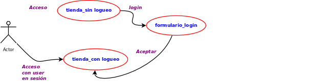
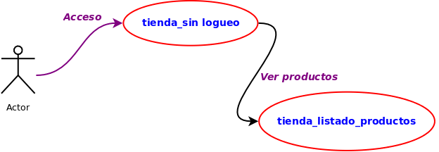
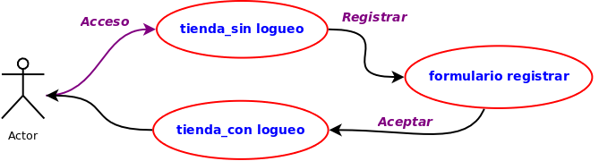
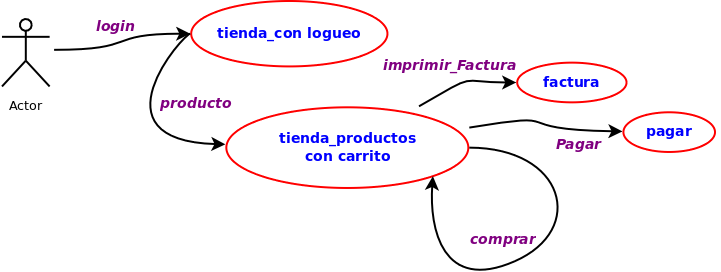
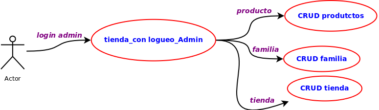
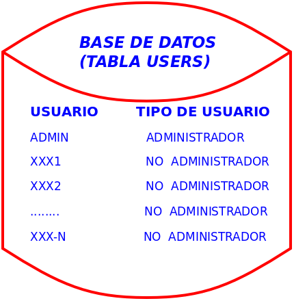

# Referencias Web

* [Markdown](https://www.markdownguide.org/basic-syntax/)
* [Paleta de colores](https://www.useit.es/blog/6-paletas-de-colores-para-diseno-web)

# Planteando el proyecto

Vamos a realizar un desarrollo incremental de diferentes sprints muy sencillos.

En cada uno de ellos realizaremos un ciclo clásico (análisis-diseño-implementación y pruebas)

Para ello utilizaremos diferentes herramientas que vamos a ir referenciando en el documento

## Proyecto tienda: Objetivo principal

***Realizar una tienda básica con las siguientes especificaciones***:
1. ***RF1*** Un usuario acceder y puede estar logueado o no logueado
 
 
***
1. ***RF2*** Un usuario no logueado solo puede ver todos los productos (solo tendrá esta opcion)

 
***
3. ***RF3*** Los usuarios se pueden registrar

***
5. ***RF4*** Un usuario logueado puede comprar, ver factura y pagar

***
6. ***RF6*** La Administradora puede gestionar todas las tablas de la tienda (Productos- Tiendas y Familias)

***
4. ***RNF1*** Un ususario logueado va a poser ser admininstrador o no serlo.
    1. El usuario administrador ya existirá en el sistema,

       
 ***

## diseño de la intefaz gráfica

Establecemos las 4 secciones en layout

# Aplicaciones utilizadas
1. Dia para diagramar
2. figma para el diseño de pantallas
3. [colorhunt](https://colorhunt.co/palette/fbf8f1f7ecdee9dac154bab9) para seleccionar colores 
4. [Colores Diseño web ](4. https://www.useit.es/blog/6-paletas-de-colores-para-diseno-web)

## Requisitos
1Menú de navegación

1. Establecer las pantallas 
   1. Pantalla princial 
      1. Header sin logueo
      2. header con logueo
      3. menu navegación
      4. main
      5. footer
   2. Panatalla de productos
      1. Cesta de la compra
   3. Pantalla de familias
   4. Pantalla de tiendas
   5. Pagar (paypall)
   6. Generar factura (pdf)

## Diseño de mokups o pantallas

1. Pantalla principal sin logueo
2. 
3. Pantalla principal con logueo
4. 
