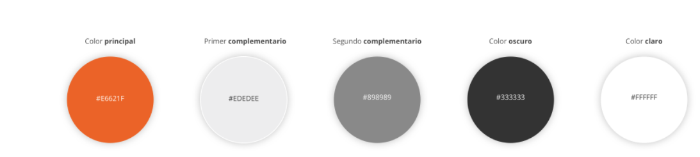

# Requisito funcional 1: Pantalla principal o layout y logueo
## Diseño de layout
* Diseño de la pantalla principal.
* Establecemos con ***balsamiq*** la siguiente pantalla principal
 Realizamos un diseño usando [balsamiq](https://balsamiq.cloud/). Es una herramienta de pago, pero online, podemos acceder a ella con nuestra cuenta de correo, si bien tiene una tiempo de prueba de un mes. Se puede conseguir clave de estudiante (estudiantes matriculados )a través del centro por un tiempo.
  Accedemos a la plataforma, el diseño es totalmente intuitivo. Realizamos un primer diseño para nuestro ***layout***


***


Vamos a añadir clases en ***tailwind*** para poder disponser de estas alturas y estos colores de fondos que hemos
elegido. Para los colores de fondo nos vasamos en la web https://www.useit.es/blog/6-paletas-de-colores-para-diseno-web
y seleccionamos la primera:



Por lo que queremos incorporar las siguientes clases en ***tailwind***:

1. 10hv
2. 15hv
3. 65hv
4. background-color: E6621F (naranja de cabecera)
4. background-color: EDEDEE  (gris del nav)
4. background-color: FFFFFF (Blanco del main)
4. background-color: 898989 (negro claro del footer)

Para este cometido editamos el fichero ***tailwind.config.js*** ubicado en la carpeta principal del proyecto y añadimos
las clases:

```json

{
// ....
theme: {
  extend: {
    //......
      height: {
                "10v": "10vh",
                "15v": "15vh",
                "65v": "65vh"
      },
      colors: {
                "header": "#E6621F",
                "nav": "#EDEDEE",
                "main": "#FFFFFF",
                "footer": "#898989"
      },
   }
// ....
}
```

Para que estos cambios tengan efecto, tenmos que traspilar la nueva configuración a un fichero css. Para ello vamos a ejectuar con ***npm** esta traspilación, para que la herramiento ***postCss*** que tenemos invocada en el fichero ***webpack.mix.js*** haga su trabajo, y genere un fichero ***/public/css/app.css*** con las nuevas clases.


Como vamos a estar haciendo cambios continuamente, vamos a configurar el sistema, para que esté atento y cada vez que el sistema detecte que se ha cambiado cualquier aspecto de la configuración del frot, transpile directemnte

Para ello, donde está invocado el script ***dev*** en el ficheor ***package.json*** aportamos el parámetro ***watch*** y de esta forma lo invcaremos con este parámetro  y ya estará activo de forma permatente

1. Modificamos el fichero ***package.json***
 ```json
#...
  "scripts": {
        "dev": "npm run development --watch",
#...

```
2. Invocamos al scrpt en el terminal (recuerda el & para ejecutarlo en background y que no se quede el terminal bloqueado)
```shell
npm run watch & 
```


Con esto, ahora ya tenemos disponibles las clases de altura y de color de fondo directamente para utilizar:

```css
h-10v h-15v h-65v bg-header bg-nav bg-main bg-footer
```

### Escribiendo el código.

*Creamos nuestro fichero de ***blade*** **layout.blade.php**
```html

<!doctype html>
<html lang="en">
<head>
    <meta charset="UTF-8">
    <meta name="viewport"
          content="width=device-width, user-scalable=no, initial-scale=1.0, maximum-scale=1.0, minimum-scale=1.0">
    <meta http-equiv="X-UA-Compatible" content="ie=edge">
    <title>Document</title>
    <link rel="stylesheet" href="{{asset('css/app.css')}}">
</head>
<body >
<header class="bg-header h-15v">
<h1>cabecera fijo img+titulo+logueo</h1>
</header>
<nav  class="bg-nav h-10v">
    <h1> menu  de navegación dependará de cada página, inyectar un yield</h1>
</nav>
<main  class="bg-main h-65v">
    <h1>principal, dependerá de cada página , inyectar un yield</h1>
</main>
<footer  class="h-10v bg-footer">
    <h1>footer  fijo @copyright contacto y podrímos aportar redes sociales</h1>
</footer>


</body>
</html>

```
Ahora aportamos el ruteo para poder visualziar la página, en el fichero ***web.php*** Esto cambiará, ya que el layout será un fichero base de coorporativismo entre  las páginas html de nuestro proyecto
```php
Route::get('/', function () {
    return view('layout');
})->name("principal");

```
Como último paso probamos a cargar la página. Para ello levantamos el servidor con el comando de ***artisan*** (recuerda el *****&***** para que no se quede el terminal bloqueado con esta acción)
```shell
php artisan serve &

```


