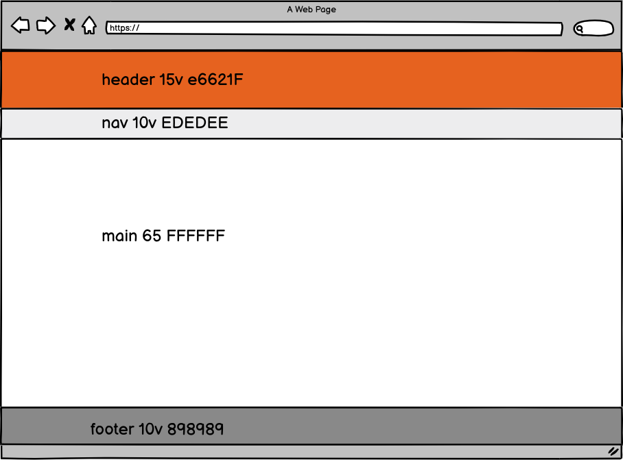

# Requisito funcional 1: Pantalla principal o layout y logueo
 Este requisito va a conllevar las siguientes acciones
1. Diseño del layout
2. Diseno de la página principal
3. Formulario para el logueo
4. Gestionar el login 


## Diseño de layout
* Diseño de la pantalla principal.
* Establecemos con ***balsamiq*** la siguiente pantalla principal
 Realizamos un diseño usando [balsamiq](https://balsamiq.cloud/). Es una herramienta de pago, pero online, podemos acceder a ella con nuestra cuenta de correo, si bien tiene una tiempo de prueba de un mes. Se puede conseguir clave de estudiante (estudiantes matriculados )a través del centro por un tiempo.
  Accedemos a la plataforma, el diseño es totalmente intuitivo. Realizamos un primer diseño para nuestro ***layout***


***


Vamos a añadir clases en ***tailwind*** para poder disponser de estas alturas y estos colores de fondos que hemos
elegido. Para los colores de fondo nos vasamos en la web https://www.useit.es/blog/6-paletas-de-colores-para-diseno-web
y seleccionamos la primera:


Por lo que queremos incorporar las siguientes clases en ***tailwind***:

1. 10hv
2. 15hv
3. 65hv
4. background-color: E6621F (naranja de cabecera)
4. background-color: EDEDEE  (gris del nav)
4. background-color: FFFFFF (Blanco del main)
4. background-color: 898989 (negro claro del footer)

Para este cometido editamos el fichero ***tailwind.config.js*** ubicado en la carpeta principal del proyecto y añadimos
las clases:

```json

{
// ....
theme: {
  extend: {
    //......
      height: {
                "10v": "10vh",
                "15v": "15vh",
                "65v": "65vh"
      },
      colors: {
                "header": "#E6621F",
                "nav": "#EDEDEE",
                "main": "#FFFFFF",
                "footer": "#898989"
      },
   }
// ....
}
```

Para que estos cambios tengan efecto, tenmos que traspilar la nueva configuración a un fichero css. Para ello vamos a ejectuar con ***npm** esta traspilación, para que la herramiento ***postCss*** que tenemos invocada en el fichero ***webpack.mix.js*** haga su trabajo, y genere un fichero ***/public/css/app.css*** con las nuevas clases.


Como vamos a estar haciendo cambios continuamente, vamos a configurar el sistema, para que esté atento y cada vez que el sistema detecte que se ha cambiado cualquier aspecto de la configuración del frot, transpile directemnte

Para ello, donde está invocado el script ***dev*** en el ficheor ***package.json*** aportamos el parámetro ***watch*** y de esta forma lo invcaremos con este parámetro  y ya estará activo de forma permatente

1. Modificamos el fichero ***package.json***
 ```json
#...
  "scripts": {
        "dev": "npm run development --watch",
#...

```
2. Invocamos al scrpt en el terminal (recuerda el & para ejecutarlo en background y que no se quede el terminal bloqueado)
```shell
npm run watch & 
```


Con esto, ahora ya tenemos disponibles las clases de altura y de color de fondo directamente para utilizar:

```css
h-10v h-15v h-65v bg-header bg-nav bg-main bg-footer
```

### Escribiendo el código.

*Creamos nuestro fichero de ***blade*** **layout.blade.php**
```html

<!doctype html>
<html lang="en">
<head>
    <meta charset="UTF-8">
    <meta name="viewport"
          content="width=device-width, user-scalable=no, initial-scale=1.0, maximum-scale=1.0, minimum-scale=1.0">
    <meta http-equiv="X-UA-Compatible" content="ie=edge">
    <title>Document</title>
    <link rel="stylesheet" href="{{asset('css/app.css')}}">
</head>
<body >
<header class="bg-header h-15v">
<h1>cabecera fijo img+titulo+logueo</h1>
</header>
<nav  class="bg-nav h-10v">
    <h1> menu  de navegación dependará de cada página, inyectar un yield</h1>
</nav>
<main  class="bg-main h-65v">
    <h1>principal, dependerá de cada página , inyectar un yield</h1>
</main>
<footer  class="h-10v bg-footer">
    <h1>footer  fijo @copyright contacto y podrímos aportar redes sociales</h1>
</footer>


</body>
</html>

```
Ahora aportamos el ruteo para poder visualziar la página, en el fichero ***web.php*** Esto cambiará, ya que el layout será un fichero base de coorporativismo entre  las páginas html de nuestro proyecto
```php
Route::get('/', function () {
    return view('layout');
})->name("principal");

```
Como último paso probamos a cargar la página. Para ello levantamos el servidor con el comando de ***artisan*** (recuerda el *****&***** para que no se quede el terminal bloqueado con esta acción)
```shell
php artisan serve &

```

A continuación vamos a diseñar la página principal. En ella vamos a realizar el siguiente diseño para el ***header*** y para el ***footer***
Ambos son elementos fijos para todas las páginas, por lo que los especificamos en el layout 


***
### El header
El header va a tener tres elementos que vamos a distribuir de la siguiente manera:
1. diseño flexible ***(flex)***
2. Colocado en una fila , o sea  horizontalmente ***flex-col***
3. Los elemntos distribuidos de forma que ocupen todo en el eje horizontal ***justify-beetwen***
4. centrado en el eje vertical ***items-center***
5. vamos a poner un pading para que no esté pegado al borde ***p-8***

Esto se traduce con las siguientes clases en el ***header*** del layout

```css
<header class="bg-header h-15v flex flex-row justify-between items-center p-8">
```

Ahora diseñaremos cada uno de los tres elementos:
1. El logo
2. El título de la empresa
3. La sección de login o logout

#### img: el logo
* El logo lo vamos a descargar de la web, buscamos una imagen que sea free y la descargamos
* La ubicamos en la carpeta ***public/images/logo.png*** (creamos la carpeta)
* En el diseño estableceremos que no sobresalga del contenedor (el header) donde esté ubicada, y referenciaremos su ubicación con el helper ***asset***, quedando el elemento como sigue
```html


```
#### El título
 Para el título vamos a poner un nombre y lo dotaremos de un tamaño grande y un color 
```html
 <h1 class="max-h-full text-6xl text-red-100">Tienda de componentes</h1>
```
#### La sección login- logout

Como ya hemos comentado esta es la sección más complicada pero laravel nos ofrece herramientas para facilitarnos el trabajo
En blade, podemos saber si estamso logueados, con la directiva ***@auth***, y si no lo estamos con la directiva ***@guest*** (o sea, que somo invitados). Con ello podemos establecer:
```html

@auth
 aquí el html que solo saldrá si estoy logueado
@endauth
@guest
 aquí el html que solo saldrá si NO estoy  logueado
@endguest

```
##### Conexión con la base de datos

* Tenemos que tener una conexión con la base de datos, y haber ejectutado las migraciones que trae laravel para podernos autentificar.
* Para ello descargamos el docker que ya tiene la base de datos de la tienda y en ella vamos a incorporar las tablas de usuarios para loguearnos
* 
###### Instalando un contenedor con docker
1. Creamos un contenedor llamado mysql a partir de la imagen que tenmos subida a docker hub llamada ***manolo/certificado-web:v2*** Esta imagen trae instalado:
   1. ***mysql***
   2. ***phpmyadmin*** (por lo tanto php y apache2)
   3. en mysql tenemos una base de datos llamada ***dwes*** que es con la que vamos a trabajar
```shell
docker run --name mysql -ti manolo/certificado-web:v1 
```

2. Por comodidad vamos a crearnos un shell que nos arranque el docker con los servicios ***mysql y apache2***. creamos un fichero llamado por ejemplo ***start_docker*** con el siguiente contenido
```shell
docker start mysql
docker exec mysql service mysql start
docker exec myadl service apache2 start 
```
3. Le damos permisos de ejecución
```shell
sudo chmos -x start_docker 
```
4.- Lo ejecutamos (observa que hay que especificar de manera explícita dónde se ubica el fichero)

```shell
./start_doker
```
###### Parámetros de conexión y ejecutar las migraciones


*Previamente tenm
Por otro lado, vamos a establecer en la propia cabecera el formulario para loguearnos (usuario y password). Para ello pondremos dos cajas de texto. El único requisito es que los nombres de los inputs
